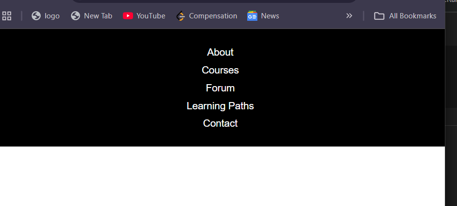

# Responsive Navbar

A simple mobile-first responsive navigation bar built using HTML and CSS.

## 📸 Screenshots

### 📱 Mobile View

### 💻 Desktop View

## 🧾 Description

- Mobile-first design
- Vertical navigation on small screens
- Horizontal navigation on larger screens (760px+)
- Items aligned to the right on large screens
- Built with Flexbox and media queries

## 🛠 Technologies Used

- HTML5
- CSS3 (Flexbox + Media Queries)

## 📂 Files

- `index.html` — main markup
- `styles.css` — style sheet
- `mobile.png` — mobile layout screenshot
- `desktop.png` — desktop layout screenshot
