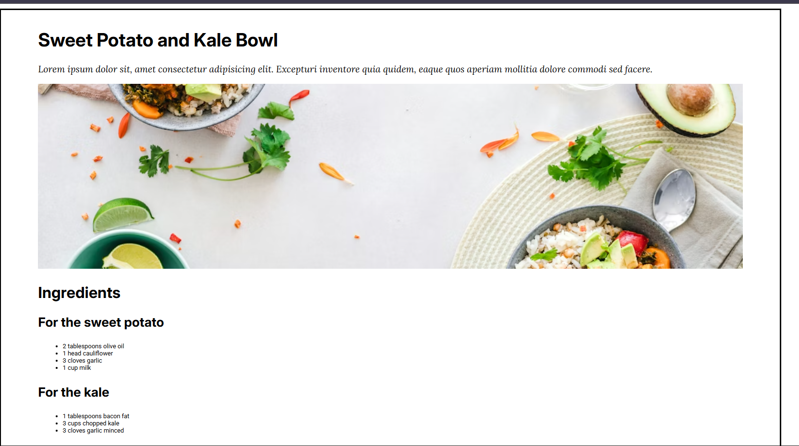
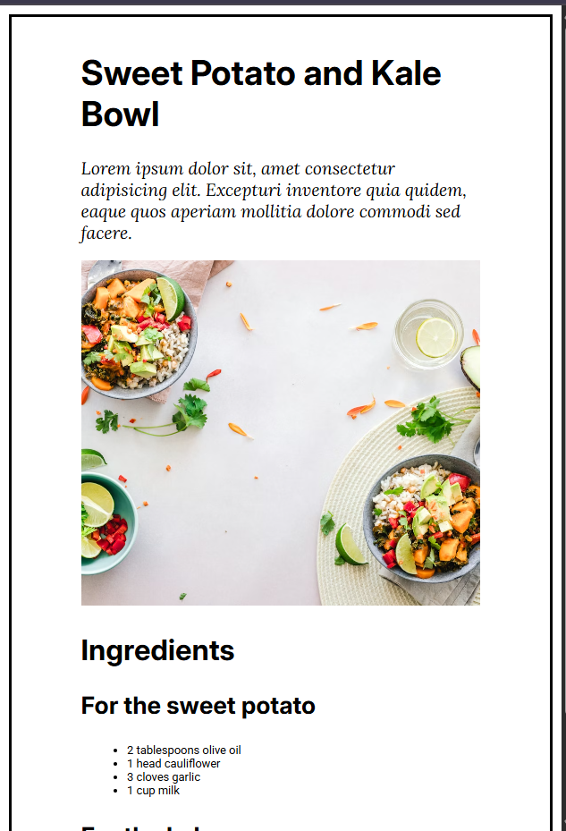

# Small Blog – Recipe Page Layout

A clean and minimal recipe blog page built using HTML and CSS.  
This project focuses on typography, spacing, Google Fonts, and responsive image handling.

---

## 📸 Screenshots

### 🖥️ Desktop View



### 📱 Mobile View



---

## 📝 Overview

This project recreates a simple recipe-style blog page featuring:

- A centered container layout (max-width: **1140px**)
- Proper font hierarchy using **three Google Fonts**
- Lead paragraph styled with a serif font and italics
- Headings styled with a different sans-serif font
- Body text styled with another sans-serif font
- Fully responsive image (`width: 100%`)
- Clean spacing using `rem` units and a 62.5% root font size
- Proper HTML structure using headings, paragraphs, and lists

This matches the design layout given in the assignment prompt.

---

## 🎨 Typography

Fonts imported from **Google Fonts**:

- **Roboto** → Body text
- **Inter** → Headings (h1–h6)
- **Lora** → Lead paragraph (italic serif)

Base font size:

```css
html {
  font-size: 62.5%;
}

This makes:

1rem = 10px

1.6rem = 16px

2rem = 20px

→ Much easier typography scaling.

📂 Files Included

index.html – main page

styles.css – typography + spacing + layout

desktop.png – desktop screenshot

mobile.png – mobile screenshot

README.md – project documentation

🛠️ Technologies Used

HTML5

CSS3

Google Fonts

Responsive Design Principles

🚀 How to View

To view the page locally:

Download or clone the repository.

Open:

index.html


in any web browser.

""" This is some layout done while practicing css"""
```
